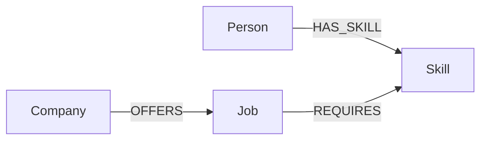
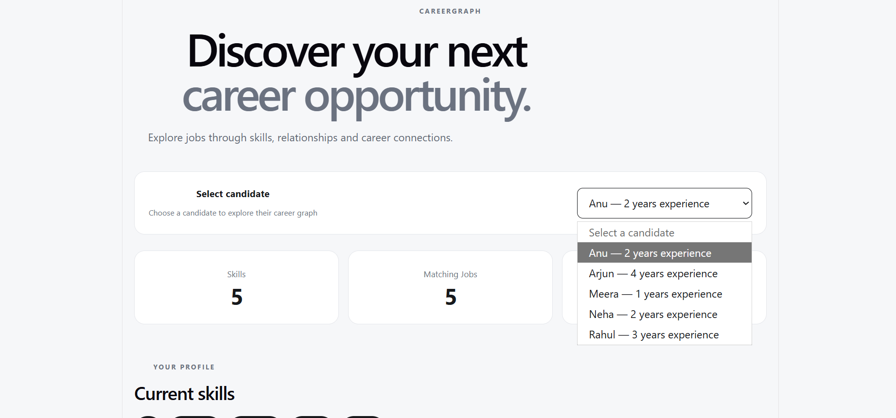
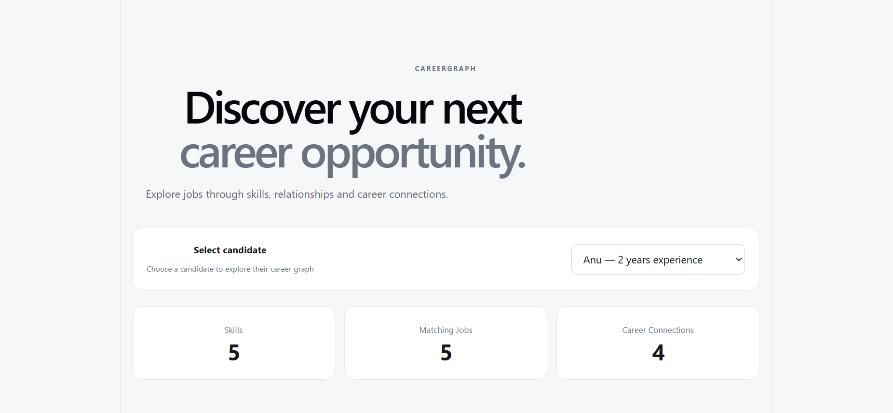
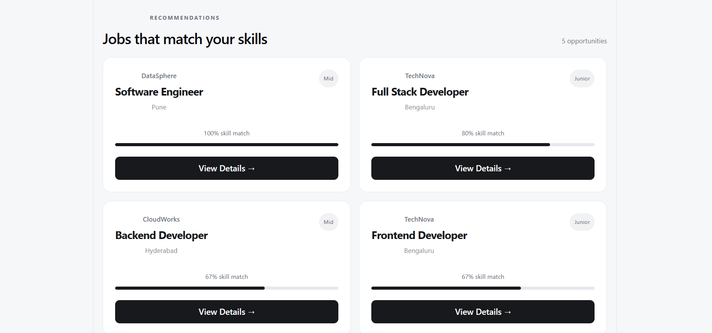
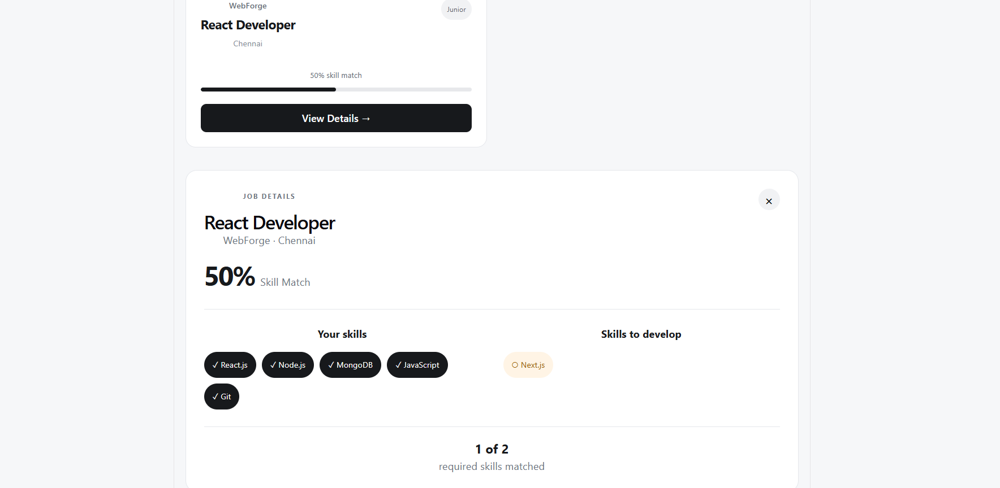
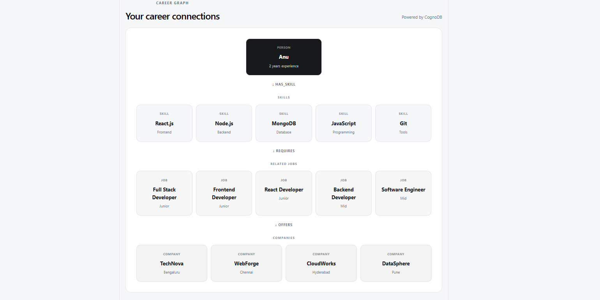
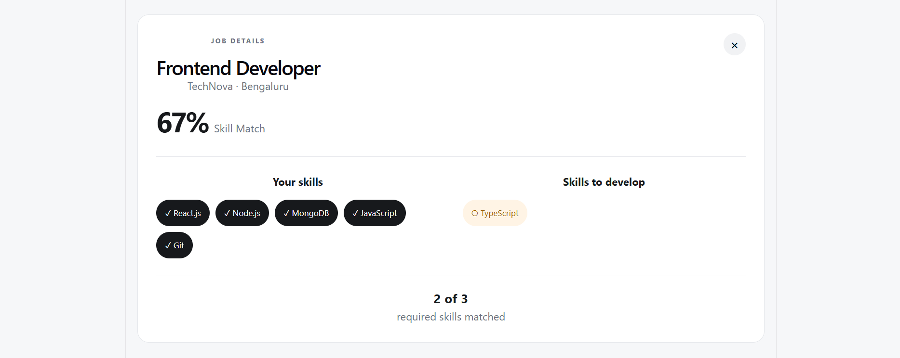

# CareerGraph

CareerGraph is a graph-based career exploration and recommendation application built using React, Node.js, Express, and CognoDB.

The application connects candidates, skills, jobs, and companies using graph relationships. Users can select a candidate, explore their current skills, view related career opportunities, identify missing skills for a particular job, and visualize their career connections.

---

## Live Demo

https://careergraph-jrmw.onrender.com/

## GitHub Repository

https://github.com/krishna-priyakm/careergraph

---

# 1. Use Case

CareerGraph helps candidates explore career opportunities based on the skills they already possess.

Instead of treating a candidate, their skills, jobs, and companies as isolated records, CareerGraph models them as connected entities.

For example:

Person → HAS_SKILL → Skill  
Job → REQUIRES → Skill  
Company → OFFERS → Job

This allows the application to answer relationship-based questions such as:

- What skills does a candidate currently have?
- Which jobs require those skills?
- Which companies offer those jobs?
- What percentage of a job's required skills does a candidate already possess?
- Which skills are missing for a particular job?
- What career connections exist for a candidate?

---

# 2. Why a Graph Database?

Career recommendations naturally involve relationships between multiple entities.

A relational database could store people, skills, jobs, and companies in separate tables, but queries involving multiple connected entities would require several joins.

A graph database represents these relationships directly.

CareerGraph uses the following relationship path:

Person → Skill ← Job ← Company

For example:

```text
Person
  │
  │ HAS_SKILL
  ▼
Skill
  ▲
  │ REQUIRES
  │
Job
  ▲
  │ OFFERS
  │
Company
```

This graph structure makes it easier to traverse relationships between candidates, skills, jobs, and companies.

---

# 3. Data Model

CareerGraph represents career-related information as connected nodes and relationships in CognoDB.

## Nodes

| Node | Description |
|------|-------------|
| `Person` | Represents a candidate/user |
| `Skill` | Represents a skill possessed by or relevant to a candidate |
| `Job` | Represents a job opportunity |
| `Company` | Represents a company offering a job |

## Relationships

| Relationship | Description |
|--------------|-------------|
| `HAS_SKILL` | Connects a person to a skill |
| `REQUIRES` | Connects a job to a required skill |
| `OFFERS` | Connects a company to a job |

## Data Model Diagram



The main relationship path used by CareerGraph is:

```text
Person → Skill ← Job ← Company
```

This structure allows the application to traverse relationships between a candidate's skills, relevant jobs, and companies.

---

# 4. Setup and Run Instructions

## Prerequisites

Install the following before running the application:

- Node.js
- npm
- Git
- CognoDB

## Clone the Repository

```bash
git clone https://github.com/krishna-priyakm/careergraph.git
cd careergraph
```

## Create the CognoDB Instance

CareerGraph uses CognoDB as its graph database.

1. Open the CognoDB service.
2. Create a new CognoDB instance.
3. Enter a name for the instance.
4. Select the required configuration and region.
5. Create the instance.
6. Wait until the instance is ready.
7. Copy the connection details provided by CognoDB.
8. Keep the database URI, username, and password for configuring the server.

The application connects to CognoDB using its Neo4j-compatible Bolt interface.

Example connection URI:

```text
bolt://localhost:7687
```

## Server Setup

Move to the server directory:

```bash
cd server
```

Install the dependencies:

```bash
npm install
```

Create a `.env` file inside the `server` directory:

```env
COGNODB_URI=<your-cognodb-uri>
COGNODB_USERNAME=<your-cognodb-username>
COGNODB_PASSWORD=<your-cognodb-password>
PORT=5000
```

Replace the placeholder values with the credentials of your CognoDB instance.

Do not commit the `.env` file to GitHub.

## Client Setup

Open another terminal and move to the client directory:

```bash
cd client
```

Install the dependencies:

```bash
npm install
```

## Run the Server

From the `server` directory:

```bash
npm start
```

The Express server starts and connects to the CognoDB database.

## Run the Client

From the `client` directory:

```bash
npm start
```

Open the URL displayed by the React development server in your browser.

---

# 5. Main Queries Explained

CareerGraph uses Cypher queries to traverse the connected career data stored in CognoDB.

## 5.1 Find a Candidate's Skills

```cypher
MATCH (p:Person)-[:HAS_SKILL]->(s:Skill)
WHERE p.id = $personId
RETURN p, s
```

This query retrieves the skills associated with a selected candidate.

The graph traversal is:

```text
Person → HAS_SKILL → Skill
```

The result is used to display the candidate's current skills.

## 5.2 Find Jobs Based on Candidate Skills

```cypher
MATCH (p:Person)-[:HAS_SKILL]->(s:Skill)<-[:REQUIRES]-(j:Job)
WHERE p.id = $personId
RETURN DISTINCT j
```

This query finds jobs that require skills possessed by the selected candidate.

The graph traversal is:

```text
Person → Skill ← Job
```

This allows CareerGraph to identify career opportunities related to the candidate's existing skills.

## 5.3 Find Companies Offering Matching Jobs

```cypher
MATCH (p:Person)-[:HAS_SKILL]->(s:Skill)<-[:REQUIRES]-(j:Job)<-[:OFFERS]-(c:Company)
WHERE p.id = $personId
RETURN DISTINCT j, c
```

This query connects a candidate's skills to relevant jobs and the companies offering those jobs.

The graph traversal is:

```text
Person → Skill ← Job ← Company
```

## 5.4 Find Missing Skills for a Job

```cypher
MATCH (j:Job)-[:REQUIRES]->(s:Skill)
WHERE j.id = $jobId
  AND NOT EXISTS {
    MATCH (p:Person)-[:HAS_SKILL]->(s)
    WHERE p.id = $personId
  }
RETURN s
```

This query identifies the skills required for a selected job that are not currently present in the candidate's skill set.

The result helps the candidate understand which skills they need to develop for the selected job.

## 5.5 Calculate Skill Match

```cypher
MATCH (p:Person)-[:HAS_SKILL]->(s:Skill),
      (j:Job)-[:REQUIRES]->(required:Skill)
WHERE p.id = $personId
  AND j.id = $jobId
WITH j,
     COUNT(DISTINCT CASE
       WHEN s.name = required.name THEN required
     END) AS matchedSkills,
     COUNT(DISTINCT required) AS totalRequiredSkills
RETURN j,
       matchedSkills,
       totalRequiredSkills,
       CASE
         WHEN totalRequiredSkills = 0 THEN 0
         ELSE ROUND((100.0 * matchedSkills) / totalRequiredSkills, 2)
       END AS matchPercentage
```

This query compares the candidate's existing skills with the skills required for a selected job.

It returns:

- Number of matched skills
- Total required skills
- Skill match percentage

The match percentage is used by CareerGraph to show how closely a candidate's skills match a job.

## 5.6 Retrieve the Candidate Graph

CareerGraph provides an API endpoint for retrieving the graph associated with a candidate.

```text
GET /api/people/P001/graph
```

For example, `P001` represents a candidate in the application.

The endpoint returns the connected graph data required by the frontend to display the candidate's career connections.

---

# 6. Screenshots of the UI

## Candidate Selection



## Career Dashboard



## Job Recommendations



## Skill Gap Analysis



## Career Graph Visualization



## Job Details

